<div align="center">

# 🏥 Wasfaty System | نظام وصفتي الإلكتروني
### Integrated Digital Platform for Prescription Management (Web & Mobile)
### المنصة الرقمية المتكاملة لإدارة الوصفات الطبية (الويب والموبايل)

[](https://developer.mozilla.org)
[](https://developer.mozilla.org)
[](https://developer.mozilla.org)
[](https://getbootstrap.com/)
[](https://flutter.dev)
[](https://dotnet.microsoft.com/)

</div>

---

## 📖 Overview | نظرة عامة
| English | العربية |
| :--- | :--- |
| **Wasfaty System** is a sophisticated technical solution aimed at automating the entire prescription lifecycle. Built with **Clean Architecture** principles to ensure scalability and security across Web and Mobile platforms. | **نظام وصفتي** هو حل تقني متطور يهدف إلى أتمتة دورة حياة الوصفة الطبية بالكامل. تم بناؤه باستخدام مبادئ **Clean Architecture** لضمان قابلية التوسع والأمان عبر منصات الويب والموبايل. |

---

## ✨ Key Features | المميزات الرئيسية
| Feature | الميزة |
| :--- | :--- |
| 🛡️ **Role-Based Security:** Strict access control via JWT for Admins, Doctors, Pharmacists, and Patients. | 🛡️ **صلاحيات محكمة:** تحكم دقيق في الوصول عبر JWT للمدراء، الأطباء، الصيادلة، والمرضى. |
| 📄 **Automated PDF:** One-click professional prescription generation with QR support. | 📄 **تقارير PDF:** إنشاء وصفات طبية احترافية بضغطة زر مع دعم رموز QR. |
| 📱 **Cross-Platform:** Seamless experience between Bootstrap web interface and Flutter mobile app. | 📱 **متعدد المنصات:** تجربة متكاملة بين واجهة الويب وتطبيق الموبايل. |
| ⚡ **Optimization:** Fast data fetching and efficient state management. | ⚡ **السرعة:** استجابة سريعة للبيانات وإدارة فعالة لحالة النظام. |

---

## 🛠 Tech Stack | التقنيات المستخدمة

| Category | Tools / التقنيات |
| :--- | :--- |
| **Front-End (Web)** | HTML5, CSS3, JavaScript (ES6+), **Bootstrap 5** |
| **Mobile App** | **Flutter**, Dart |
| **Back-End API** | **ASP.NET Core**, Entity Framework |
| **Database** | SQL Server |
| **Security** | JWT (JSON Web Tokens) |

---

## 🔐 Permissions Matrix | مصفوفة الصلاحيات

| Action / الإجراء | 👑 Admin | 👨‍⚕️ Doctor | 💊 Pharmacist | 👤 Patient |
| :--- | :---: | :---: | :---: | :---: |
| Manage Users & Entities / إدارة النظام | ✅ | ❌ | ❌ | ❌ |
| Issue New Prescriptions / إنشاء وصفة | ✅ | ✅ | ❌ | ❌ |
| Dispense Medications / صرف الأدوية | ✅ | ❌ | ✅ | ❌ |
| View Medical History / عرض السجل | ❌ | ✅ | ✅ | ✅ |

---

## 📂 Project Structure | هيكل المشروع

```text
Wasfaty-FrontEnd/
├── pages/
│   ├── auth/         # Login & Register System
│   ├── admin/        # Dashboard, Users & Medications Manage
│   ├── doctor/       # Patient Lists & Prescription Creation
│   ├── pharmacist/   # Pending Prescriptions & Dispensing logic
│   └── patient/      # Personal Profile & PDF Export
├── js/               # Core Logic (Auth, API Helpers, Role Handlers)
├── css/              # Custom Styles & Theme Overrides
└── images/           # Assets & UI Screenshots
```
-----
## 📸 System Screenshots | واجهات النظام

---

### 1️⃣ Essential Screens | الصور العامة

| Login Screen | Register Screen | Access Denied (403) |
| :---: | :---: | :---: |
| 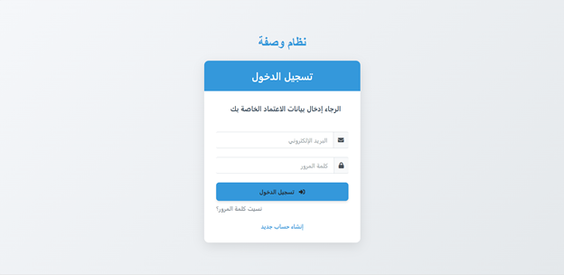 | 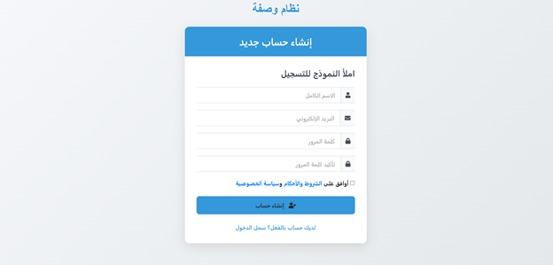 | 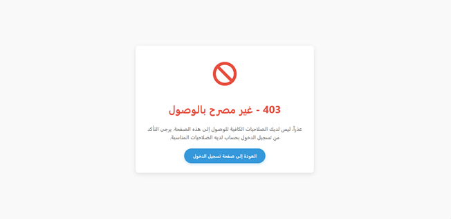 |
| *Login interface with fields and responsive design* | *New patient registration form* | *Permission protection system* |
| *واجهة تسجيل الدخول مع الحقول والتصميم المتجاوب* | *إنشاء حساب جديد للمريض* | *نظام حماية الصلاحيات* |

---

### 2️⃣ Admin Dashboard | واجهات المدير

| Main Dashboard | Users List | Add New User |
| :---: | :---: | :---: |
| 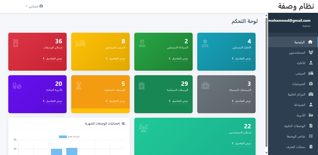 | 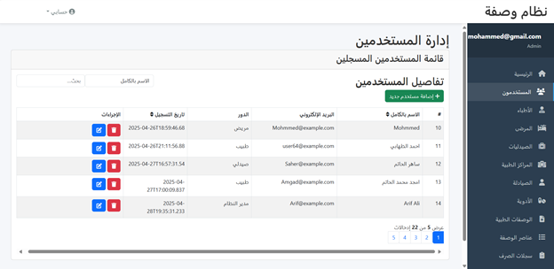 | 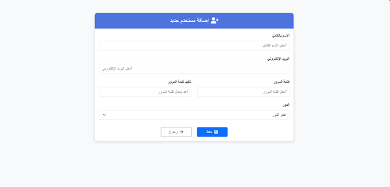 |
| *Statistics and charts overview* | *Users table with edit/delete buttons* | *Add user form with role selection* |
| *الإحصائيات والرسوم البيانية* | *جدول المستخدمين + أزرار التعديل والحذف* | *نموذج إضافة مستخدم وتحديد دوره* |

| Medications Management | Pharmacy Details |
| :---: | :---: |
| 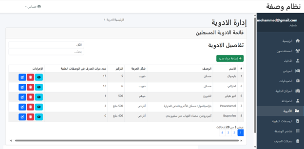 | 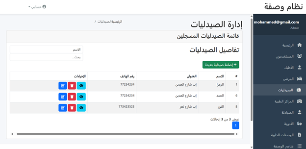 |
| *Medications CRUD screen* | *Pharmacy details with pharmacists list* |
| *شاشة إدارة الأدوية (CRUD)* | *تفاصيل الصيدلية + قائمة الصيادلة* |

---

### 3️⃣ Doctor Dashboard | واجهات الطبيب

| Doctor Dashboard | Patients List | Create Prescription |
| :---: | :---: | :---: |
| 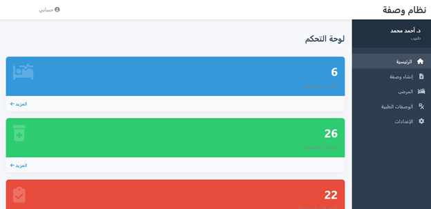 | 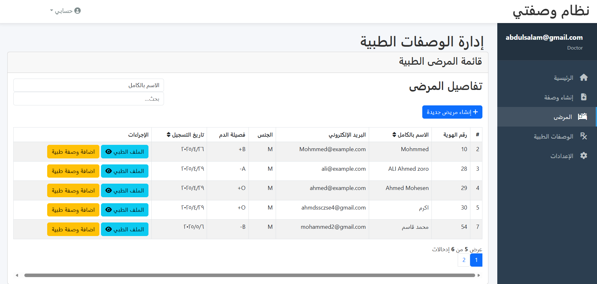 | 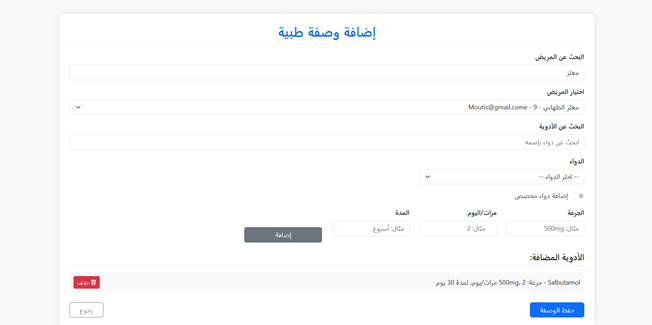 |
| *Patients and prescriptions summary* | *List of patients under the doctor* | *Select medication and dosage for patient* |
| *ملخص عدد المرضى والوصفات* | *قائمة المرضى التابعين للطبيب* | *اختيار الدواء والجرعة للمريض* |

| Prescription View |
| :---: |
| 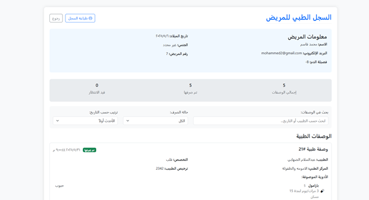 |
| *Prescription details before dispensing* |
| *الوصفة بعد إنشائها وقبل صرفها* |

---

### 4️⃣ Pharmacist Dashboard | واجهات الصيدلي

| Pending Prescriptions | Dispense Confirmation | Dispense Success |
| :---: | :---: | :---: |
| 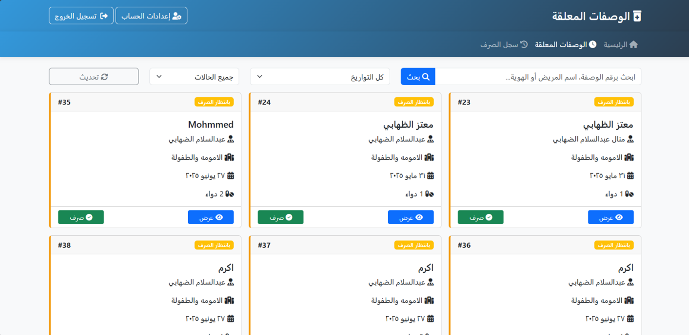 | 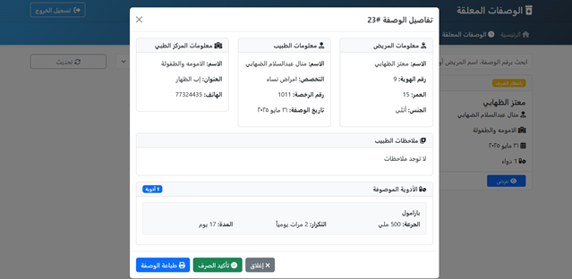 | 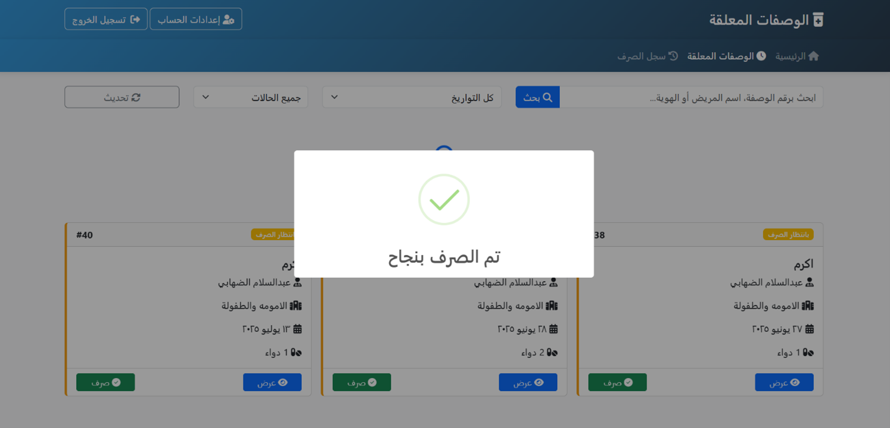 |
| *List of prescriptions waiting to be dispensed* | *Dispense confirmation dialog/page* | *Success message after dispensing* |
| *قائمة الوصفات التي تنتظر الصرف* | *نافذة تأكيد عملية الصرف* | *رسالة نجاح بعد الصرف* |

---

### 5️⃣ Patient Dashboard | واجهات المريض

| Patient Dashboard | My Prescriptions | Download Prescription PDF |
| :---: | :---: | :---: |
| 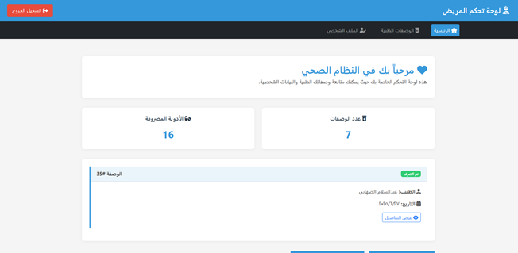 | 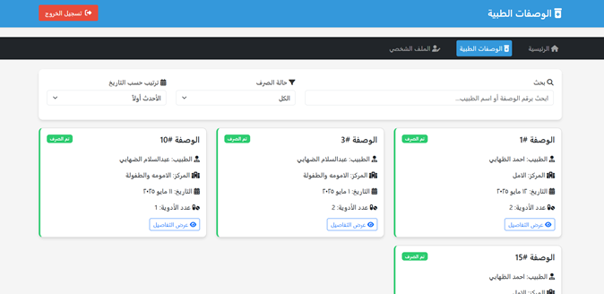 | 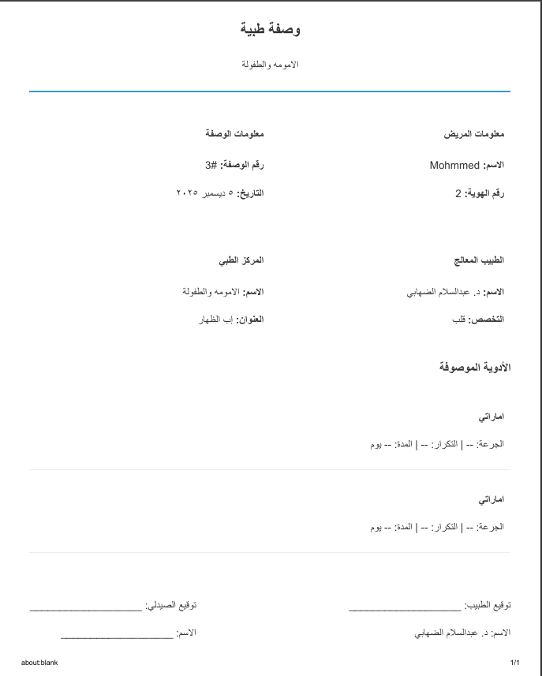 |
| *Recent medications and prescriptions* | *Prescriptions list (dispensed/pending)* | *Generated PDF file preview* |
| *آخر الأدوية والوصفات* | *الوصفات (مصروفة/معلقة)* | *ملف PDF الناتج عن التحميل* |

| Edit Profile |
| :---: |
| 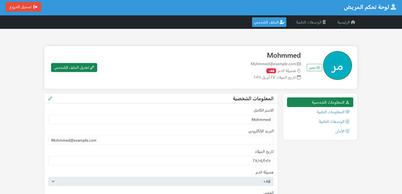 |
| *Personal information and blood type update* |
| *تحديث البيانات الشخصية وفصيلة الدم* |


-----

## 🚀 Installation & Setup | كيفية التشغيل

| Step | Action / الإجراء |
| :--- | :--- |
| 1️⃣ **Clone** | `git clone https://github.com/abdo7806/WasfatyProject_front-end.git` |
| 2️⃣ **Configure** | Update **API_BASE_URL** in `js/config.js` |
| 3️⃣ **Launch** | Open `pages/auth/login.html` with **Live Server** |
-----


## 🔗 Connected Repositories | المشاريع المرتبطة
* **⚙️ Back-End API:** [View Repo](https://github.com/abdo7806/WasfatyProject.git)
* **📱 Mobile App:** [View Repo](https://github.com/abdo7806/Wasti-Mobile-Project.git)

---
## 👨‍💻 Developer | المطور

<table align="center">
  <tr>
    <td align="center" width="150">
      
      <br />
      <b>Abdulsalam AL-Dhahabi</b>
    </td>
    <td>
      <p><b>Software Engineer / Full-Stack Developer</b></p>
      <p>Passionate about building scalable digital solutions with a focus on Clean Code. <br> مطور شغوف ببناء حلول برمجية متكاملة وقابلة للتوسع مع التركيز على جودة الكود.</p>
      <p>
        <a href="mailto:balzhaby26@gmail.com"></a>
        <a href="https://linkedin.com/in/abdulsalam-al-dhahabi-218887312"></a>
        <a href="https://github.com/abdo7806"></a>
      </p>
    </td>
  </tr>
</table>

<div align="center">
  ⭐ <b>Don't forget to star the repo if you find it helpful!</b> ⭐
</div>
